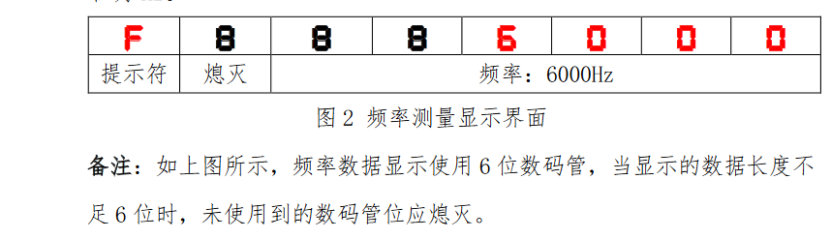

## 数码管

### 底层代码

```c
code unsigned char seg_dula[] = {0xc0, 0xf9, 0xa4, 0xb0, 0x99, 0x92, 0x82, 0xf8, 0x80, 0x90, 0xff, 0x88};
code unsigned char seg_wela[] = {0x01, 0x02, 0x04, 0x08, 0x10, 0x20, 0x40, 0x80};

void Seg_Disp(unsigned char wela, dula, point)
{
	P0 = 0xff;
	P2 = P2 & 0x1f | 0xe0;
	P2 &= 0x1f;

	P0 = seg_wela[wela];
	P2 = P2 & 0x1f | 0xc0;
	P2 &= 0x1f;

	P0 = seg_dula[dula];
	if (point)
		P0 &= 0x7f;
	P2 = P2 & 0x1f | 0xe0;
	P2 &= 0x1f;
}
```

```c
unsigned char Seg_Buf[8] = {10, 10, 10, 10, 10, 10, 10, 10}; // 数码管显示数据
unsigned char Seg_Point[8] = {0, 0, 0, 0, 0, 0, 0, 0};		 // 数码管小数点数据
unsigned char Seg_Pos;										 // 数码管扫描位置
unsigned int Slow_Down;										 // 减速计数器
bit Seg_Flag, Key_Flag;										 // 数码管和按键的标志位

void Seg_Proc()
{
	if (Seg_Flag)return;
	Seg_Flag = 1; // 数码管减速程序
}

void Timer1_Isr(void) interrupt 3
{
   	if (++Slow_Down == 400)
	{
		Seg_Flag = Slow_Down = 0; // 更新数码管显示标志位
	}
	if (Slow_Down % 10 == 0)
	{
		Key_Flag = 0; // 更新按键处理标志位
	}
    
	Seg_Disp(Slow_Down % 8, Seg_Buf[Slow_Down % 8], Seg_Point[Slow_Down % 8]); // 更新数码管显示
}
```


#### 数码管推导


### 基本调用方法

```c
Seg_Buf[x] = y;
Seg_Point[x] = y;
```

### 显示整数

```c
Seg_Buf[0] = 0;//在第0位显示第0个断码的数
Seg_Buf[0] = Temperature / 100 % 10;//显示Temperature的百位
Seg_Buf[0] = Temperature / 10 % 10;//显示Temperature的十位
Seg_Buf[0] = Temperature % 10;//显示Temperature的个位
```

### 显示带小数点变量

```c
Seg_Point[5] = 1;//第五位的小数点使能
Seg_Buf[0] = (unsigned int)(Temperature * 100) / 10 % 10;//显示小数点后一位
Seg_Buf[0] = (unsigned int)(Temperature * 100) % 10;//显示小数点后两位
/*强制类型转换看数字长度选用合适数据类型*/
```

<span style="font-size:1.4em;">四舍五入：只需在需要位+5即可</span>

```c
/*四舍五入至小数点后一位*/
Seg_Buf[0] = (unsigned int)((Temperature * 100) + 5) / 100 % 10;
```

### 高位熄灭



```c
void Seg_Proc();
{
    unsigned char i = 3;//最高位
    
    while(Seg_Buf[i] == 0)
    {
        Seg_Buf[i] = 10;
        if(++i == 7)
        break;
    }
}
```

### 选中单位闪烁

```c
unsigned char Timer_1000Ms;//两百毫秒计时变量
bit Seg_Star_Flag;//数码管闪烁标志位


void Timer0Server() interrupt 1
{  
	if(++Timer_1000Ms == 1000)
	{
		Timer_1000Ms = 0;
		Seg_Star_Flag ^= 1;
	}
}

if(Set_Flag != 0) //闪烁使能
{
	Seg_Buf[3*ucRtc_Set_Index] = Seg_Star_Flag?10:Set_Index[Set_Flag] / 16;
	Seg_Buf[3*ucRtc_Set_Index+1] = Seg_Star_Flag?10:Set_Index[Set_Flag] % 16;
}

```


