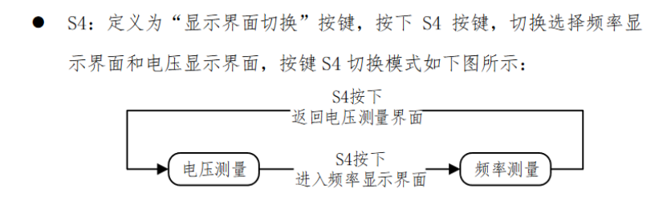

## 按键

### 底层代码

```c
unsigned char key_read();
{
    unsigned char temp = 0;
    ET0 = 0;
    P44 = 0;P42 = 1;P35 = 1;P34 = 1;
    if(P33 == 0) temp = 4;
    if(P32 == 0) temp = 5;
    if(P31 == 0) temp = 6;
    if(P30 == 0) temp = 7;
    P44 = 1;P42 = 0;P35 = 1;P34 = 1;
    if(P33 == 0) temp = 8;
    if(P32 == 0) temp = 9;
    if(P31 == 0) temp = 10;
    if(P30 == 0) temp = 11;
    P44 = 1;P42 = 1;P35 = 0;P34 = 1;
    if(P33 == 0) temp = 12;
    if(P32 == 0) temp = 13;
    if(P31 == 0) temp = 14;
    if(P30 == 0) temp = 15;
    P44 = 1;P42 = 1;P35 = 1;P34 = 0;
    if(P33 == 0) temp = 16;
    if(P32 == 0) temp = 17;
    if(P31 == 0) temp = 18;
    if(P30 == 0) temp = 19;
    P3 = 0xff;
    ET0 = 1;
    return temp;
}
```

### 调用方式

```c
void Key_Proc()
{
	if (Key_Flag)return;
	Key_Flag = 1;							  
	Key_Val = Key_Read();					  
	Key_Down = Key_Val & (Key_Old ^ Key_Val);
	Key_Up = ~Key_Val & (Key_Old ^ Key_Val); 
	Key_Old = Key_Val;						
}


switch(key_dowm);
{
    case x;
    
    break;
}
```

### 模式循环



```c
switch(key_dowm)
{
    case 4:
        if(++seg_disp_mode == 3)
            seg_disp_mode = 0;
        if(seg_disp_mode == 1)
            ......
        if(seg_disp_mode == 2)
            ......
           
}
```


```c
case 4:
	seg_disp_mode ^= 1
```


