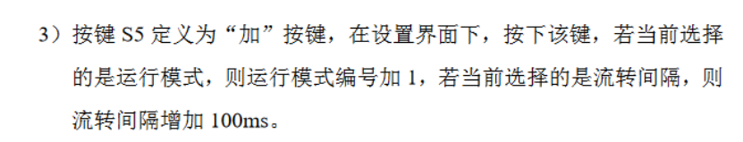

## 按键

### 底层代码

```c
unsigned char key_read();
{
    unsigned char temp = 0;
    ET0 = 0;
    P44 = 0;P42 = 1;P35 = 1;P34 = 1;
    if(P33 == 0) temp = 4;
    if(P32 == 0) temp = 5;
    if(P31 == 0) temp = 6;
    if(P30 == 0) temp = 7;
    P44 = 1;P42 = 0;P35 = 1;P34 = 1;
    if(P33 == 0) temp = 8;
    if(P32 == 0) temp = 9;
    if(P31 == 0) temp = 10;
    if(P30 == 0) temp = 11;
    P44 = 1;P42 = 1;P35 = 0;P34 = 1;
    if(P33 == 0) temp = 12;
    if(P32 == 0) temp = 13;
    if(P31 == 0) temp = 14;
    if(P30 == 0) temp = 15;
    P44 = 1;P42 = 1;P35 = 1;P34 = 0;
    if(P33 == 0) temp = 16;
    if(P32 == 0) temp = 17;
    if(P31 == 0) temp = 18;
    if(P30 == 0) temp = 19;
    P3 = 0xff;
    ET0 = 1;
    return temp;
}
```

### 调用方式

```c
void Key_Proc()
{
	if (Key_Flag)return;
	Key_Flag = 1;							  
	Key_Val = Key_Read();					  
	Key_Down = Key_Val & (Key_Old ^ Key_Val);
	Key_Up = ~Key_Val & (Key_Old ^ Key_Val); 
	Key_Old = Key_Val;						
}


switch(key_dowm);
{
    case x;
    
    break;
}
```

### 模式循环


```c
switch(key_dowm)
{
    case 4:
        if(++seg_disp_mode == 3)
            seg_disp_mode = 0;
        if(seg_disp_mode == 1)
            ......
        if(seg_disp_mode == 2)
            ......
           
}
```


```c
case 4:
	seg_disp_mode ^= 1
```

### 参数设置

第九届省赛真题

```c
switch(Key_Down)
{
    switch(Seg_Disp_Mode)
		{
			case 1://流转时间
				Circulation_Tm_Invl[Running_Mode - 1] += 100;
				if(Circulation_Tm_Invl[Running_Mode - 1] == 1300)
					Circulation_Tm_Invl[Running_Mode - 1] = 1200;//设置上限为1200
				break;
		}       
}
```

第八届省赛真题

```c
switch(key_dowm)
{
     case 1：
         if(seg_disp_mode == 0)
         {
              ucrtc_set[ucrtc_set_index]++;
              if(ucrtc_set[ucrtc_set_index] % 16 == 0x0a)//时间是十进制，但使用十六进制数组，所以但个位为10时，手动+6进位
              ucrtc_set[ucrtc_set_index] += 6;
              if(ucrtc_set[ucrtc_set_index]  == (ucrtc_set_index?0x60:0x24))
              ucrtc_set[ucrtc_set_index] = ucrtc_set_index?0x59:0x23;//设置上限
          }
}
```

### 参数保存

第五届省赛真题

```c
显示值等于控制值
```

第十一届省赛真题

```c
if(Temperature_Params_Disp[0] > Temperature_Params_Disp[1]) //设置参数合理
	{
		//将显示值赋值给控制数组 用于保存数据
		Temperature_Params_Ctrol[0] = Temperature_Params_Disp[0];
		Temperature_Params_Ctrol[1] = Temperature_Params_Disp[1];
		Error_Flag = 0;//标志位拉低 表示设置正确
	}
else
	Error_Flag = 1;//标志位拉高 表示设置错误

```

第十一届省赛真题

```c
case 6://参数自加
			if(Seg_Disp_Mode == 1) //处于参数界面
			{
				if(++Temperature_Params_Disp[Temperature_Params_Index] == 100)
					Temperature_Params_Disp[Temperature_Params_Index] = 99;//限制上限到99
			}
```

### 长按跳转，送手返回

```c
if(key_old == 4)//old为实时键码值
    seg_disp_mode = 1;
else
    seg_disp_mode = 0;
```

### 键盘输入

```c
unsigned char Seg_Input[3] = {11,11,11};//数码管输入数据存放数组
unsigned char Seg_Input_Index;//数码管输入数组指针


if(Key_Down >= 1 && Key_Down <= 10 && Seg_Input_Index <= 2)//矩阵输入键盘使能
{
	Seg_Input[Seg_Input_Index] = Key_Down - 4;//将输入数值给输入数组
	Seg_Input_Index++;//数组指针加一
}
```

### 长按短按，效果不同


```c
unsigned int Count_500Ms;//五百毫秒计数变量
bit Time_Flag;//计时启动标志位


/* 键盘处理函数 */
void Key_Proc()
{
    if(Seg_Disp_Mode == 2)//处于参数设置界面
	{
		if(Key_Down == 14)//S14按下
			Time_Flag = 1;//计时开始
	}
	if(Count_500Ms < 500)//短按
	{
		......
	}
	else//长按
	{
        ......
		if(Key_Up == 14)//S14抬起
			Time_Flag = Count_500Ms = 0;//状态复位
	}
}


/* 定时器0中断服务函数 */
void Timer0Server() interrupt 1
{
	if(Time_Flag == 1)
	{
		if(++Count_500Ms == 600)//自加到五百毫秒以上就可以限制住 防止一直按下自加的时候数值越界
			Count_500Ms = 600;
	}
}
```


